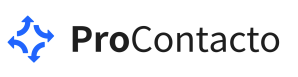
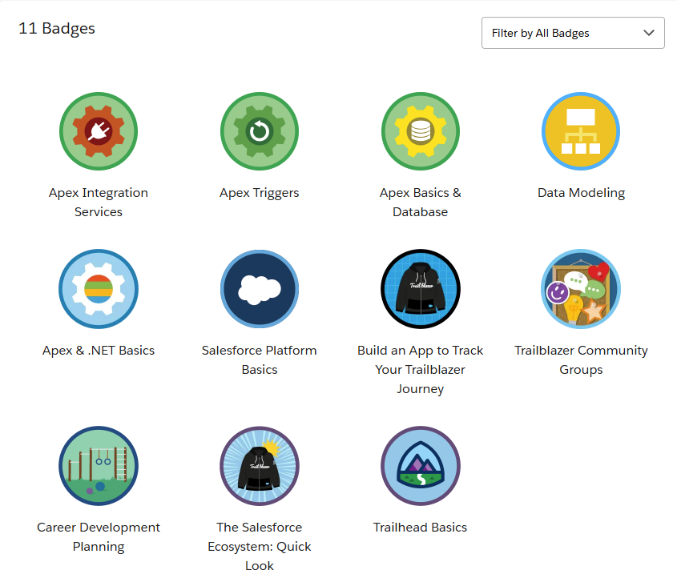

<p align="center">
  <a href="">
    
  </a>
</p>

Joel Murillo
Año 2025

:loudspeaker: En caso de que no funcionen las imagenes dejo un pdf con dos alternativas para acceder a el. 
[PDF en el repo](./gitpdf.pdf)

[Pdf en drive]([https://drive.google.com](https://drive.google.com/drive/folders/1zK0kMcq-wtxHkYW1kW8W6vnwSCVQBRKS?usp=sharing))
## Tabla de indices
- [Ejercicio 1](#ejercicio-1)
- [Ejercicio 2](#ejercicio-2)
- [Ejercicio 3](#ejercicio-3)
- [Ejercicio 4](#ejercicio-4)
- [Ejercicio 5](#ejercicio-5)
- [Ejercicio 6](#ejercicio-6)

---

## Ejercicio 1

### VSCODE


### GIT BASH


---

## Ejercicio 2

1. Es un **servidor** que utiliza el **protocolo HTTP** para el manejo de solicitudes.

2. Son **comandos o tipos de solicitudes** que un cliente o usuario le puede hacer a un servidor HTTP:

   - **GET:** Obtener información  
   - **POST:** Insertar información  
   - **DELETE:** Eliminar información  
   - **PUT:** Modificar o reemplazar información  

4. Un **request** es una solicitud que un cliente le realiza al servidor, y un **response** es la respuesta que devuelve el servidor a esa solicitud.

5. Los **headers** son información adicional que se envía al ocurrir un request o response.  
   Por ejemplo: la fecha y hora de la solicitud, o el formato de texto utilizado.

6. **¿Qué es un queryString?**  
   Es la parte de una URL que contiene **parámetros adicionales** enviados al servidor, después del signo `?`.  
   Ejemplo: https://example.com/cliente?id=123&nombre=Joel

7. Es un **código de estado HTTP** que indica si la solicitud fue manejada correctamente o si ocurrió un fallo:

- `200 OK` → Solicitud exitosa  
- `300 REDIRECCIÓN` → El recurso fue movido o redirigido  
- `400 ERROR CLIENTE` → Solicitud incorrecta  
- `500 ERROR SERVIDOR` → Fallo interno del servidor  

8. La **data para un GET** se envía desde la **URL**, por ejemplo:localhost/Cliente?id=123
Mientras que los datos para realizar un **POST** se envían a través del **body**, por ejemplo:  
```json
{
  "nombre": "Joel",
  "edad": 25
}
```
9. El verbo que utiliza el navegador cuando accedemos a una pagina es GET.

10. XML un lenguaje de marcado que usa etiquetas para estructurar y describir datos.
  ```xml
   <usuario>
     <nombre>Joel</nombre>
     <estado>online</estado>
   </usuario>
  ```
   JSON es un formato de texto ligero para representar datos estructurados, fácil de leer y procesar por humanos y máquinas.
  ```json
   {
     "nombre": "Joel",
     "estado": "online"
   }
  ```
12. SOAP es un protocolo de comunicación que utiliza mensajes en formato XML para intercambiar información entre aplicaciones a través de la red. Define una estructura estricta y suele usarse en entornos empresariales donde se requiere seguridad y confiabilidad.
13. REST es un estilo de arquitectura que usa los métodos estándar de HTTP (GET, POST, PUT, DELETE) para acceder y manipular recursos a través de URLs. Es más liviano que SOAP y generalmente utiliza el formato JSON para enviar y recibir datos.
14. Los headers son parte de una solicitud HTTP y contienen información adicional o metadatos sobre la petición, como la autenticación, el tipo de contenido o la longitud de los datos enviados.
El header Content-Type se utiliza para indicar el formato del contenido que se envía en el cuerpo del request, por ejemplo application/json si los datos están en formato JSON o application/xml si están en XML.
---

## Ejercicio 3

1. Realizar un request GET a la URL:


2. Realizar un request POST a la URL anterior, y con body:


3. Realizar nuevamente un request GET a la URL:


¿Qué diferencias se observan entre las llamadas el punto 1 y 3?

En el paso 3 aparecen mis datos, los cuales no estaban presentes en el paso 1. Esto se debe al POST que realicé con mis datos en el paso 2.

---
## Ejercicio 4
[](https://www.salesforce.com/trailblazer/ytp32goxlbrkzkzx8h)




---
## Ejercicio 5

### 1. Lead
**Concepto:** Representa un prospecto o posible cliente.  
**Datos estándar:** Nombre, empresa, email, teléfono, fuente de origen, estado.  
**Relaciones:**  
-No se relaciona con ninguno de los Objects presentados.

---

### 2. Account
**Concepto:** Empresa o cliente con el que la organización mantiene una relación.  
**Datos estándar:** Nombre, tipo (cliente, partner, proveedor), industria, dirección.  
**Relaciones:**  
- 1 `Account` → N️ `Contact`
- 1 `Account` → N️ `Opportunity`
- 1 `Account` → N️ `Case`
- 1 `Account` → N️ `Asset`
- 1 `Account` → N️ `Account`
  
---

### 3. Contact
**Concepto:** Persona asociada a una cuenta (cliente o socio).  
**Datos estándar:** Nombre, cargo, email, teléfono, dirección.  
**Relaciones:**  
- N `Contact` → 1 `Account`
- 1 `Contact` → N `Case`
- 1 `Contact` → N `Asset`
- 1 `Contact` → N `Contact`


---

### 4. Opportunity
**Concepto:** Representa una oportunidad de venta.  
**Datos estándar:** Nombre, etapa, monto, fecha de cierre, probabilidad.  
**Relaciones:**  
- 1 `Opportunity` → N `Quote`
- N `Opportunity` → 1 `Price Book`
- 1 `Opportunity` → N `Asset`

---

### 5. Product
**Concepto:** Producto o servicio ofrecido por la empresa.  
**Datos estándar:** Nombre, código, familia, descripción, precio base.  
**Relaciones:**  
- 1 `Product` → N `Case`
- N️ `Product` → 1 `Product`
- 1 `Product` → N `Asset`


---

### 6. Price Book
**Concepto:** Lista de precios de los productos.  
**Datos estándar:** Nombre, estado (activo/inactivo).  
**Relaciones:**  
- 1 `Price Book` → N️ `Opportunity`
---

### 7. Quote
**Concepto:** Cotización o presupuesto ofrecido al cliente.  
**Datos estándar:** Nombre, fecha, monto total, estado, descripción.  
**Relaciones:**  
- N️ `Quote` → 1 `Opportunity`

---

### 8. Asset
**Concepto:** Producto físico o servicio vendido/instalado para un cliente.  
**Datos estándar:** Nombre, número de serie, producto, estado, fecha de compra.  
**Relaciones:**  
- N️ `Asset` → 1 `Account`
- N️ `Asset` → 1 `Contact`
- N️ `Asset` → 1 `Product`
- N️ `Asset` → 1 `Asset`
- 1 `Asset` → N `Case`

---

### 9. Case
**Concepto:** Representa una incidencia o solicitud de soporte.  
**Datos estándar:** Número de caso, asunto, descripción, estado, prioridad.  
**Relaciones:**  
- N️ `Case` → 1 `Account`
- N️ `Case` → 1 `Contact`
- N️ `Case` → 1 `Product`
- N️ `Case` → 1 `Case`
- N️ `Case` → 1 `Asset`
---

### 10. Article (Knowledge)
**Concepto:** Documento de conocimiento o solución a un problema.  
**Datos estándar:** Título, contenido, categoría, estado.  
**Relaciones:**  
-No se relaciona de forma directa con ninguna de las 9 restantes.

---
### Diagrama


---


## Ejercicio 6

##  Salesforce – Conceptos y Funcionalidades

###  Soluciones de Salesforce

**A. Salesforce**: es un **CRM (Customer Relationship Management)** que corre en la nube. Permite gestionar clientes, ventas y servicios desde cualquier lugar.  

**B. Sales Cloud:** Solución enfocada en **ventas**. Permite gestionar Leads, Cuentas, Contactos, Oportunidades y Pronósticos de venta.  

**C. Service Cloud:** Solución para **atención al cliente y soporte**. Permite manejar Casos, SLA, Chat, Knowledge Articles y Omnichannel.  

**D. Health Cloud:** Plataforma de Salesforce adaptada al **sector salud**, que gestiona pacientes con sus respectivos historiales y relaciones medico-paciente.  

**E. Marketing Cloud:** Solución para **marketing digital y automatización**, que gestiona campañas, segmentaciones y comunicación (email, SMS, redes sociales).  

---

###  Funcionalidades de Salesforce

**A. RecordType:** Define **diferentes tipos de registros** dentro de un mismo objeto, con layouts, procesos y picklists distintos.  

**B. ReportType:** Determina **qué objetos y relaciones** se incluyen en un reporte. Es la base sobre la que se crean los informes.  

**C. Page Layout:** Define **qué campos, secciones y botones** se muestran en la vista de detalle de un registro.  

**D. Compact Layout:** Muestra **campos clave en la parte superior** del registro (vista destacada en móviles y Lightning).  

**E. Perfil:** Controla **permisos de acceso** a objetos, campos, pestañas y funciones dentro del sistema.  

**F. Rol (Role):** Define la **jerarquía de visibilidad de datos** entre usuarios (quién puede ver los registros de quién).  

**G. Validation Rule:** Regla que **valida datos antes de guardar** un registro (por ejemplo evitar datos inconsistentes).  

**H. Master Detail vs Lookup:**  
- **Master-Detail:** Relación fuerte; el detalle depende del maestro (si el maestro se borra, el detalle tambien).  
- **Lookup:** Relación débil; los registros son independientes.  

**I. Sandbox:** Copia del entorno de producción para **probar, desarrollar o capacitar** sin afectar los datos reales.  

**J. ChangeSet:** Mecanismo para **migrar configuraciones y código** entre entornos Salesforce (por ejemplo, de Sandbox a Producción).  

**K. Import Wizard:** Herramienta para **importar datos** (Leads, Accounts, Contacts, etc.) desde archivos CSV.  

**L. Web to Lead:** Permite **crear Leads automáticamente** desde formularios web públicos.  

**M. Web to Case:** Permite **crear Casos automáticamente** desde formularios web de soporte.  

**N. Omnichannel:** Distribuye automáticamente **Casos, Chats o Tareas** al agente más disponible o adecuado.  

**O. Chatter:** Red social interna para **colaboración entre empleados**, comentarios, publicaciones y seguimientos.  

---

###  Conceptos Generales

**A. Software as a Platform (PaaS)**:es una forma de ofrecer aplicaciones de forma remota por internet en lugar de hacerlo de forma local(ejemplo: Salesforce).  

**B. Salesforce es SaaS:** Sí, porque ofrece software listo para usar desde la nube (sin instalación local).  

**C. Corre en la nube:** El cliente no necesita hardware propio, para correr la solucion , sino que esta corre en servidores distribuidos por todo el mundo.  

**D. Solución On-Premise:** Software que se **instala y mantiene localmente** en los servidores del cliente.  

**E. Pipeline de ventas:** el pipeline representa las diferentes etapas por las que debe pasar el potencial cliente para adquirir el producto o servicio.

**F. Funnel de ventas:** Un embudo de ventas es una representación visual del recorrido que realiza un cliente desde el primer instante que entra en contacto con una marca, hasta que finalmente toma una decisión de compra. 

**G. Customer Experience:** La percepción global del cliente sobre una marca a lo largo de todas sus interacciones.  

**H. Omnicanalidad:** es un enfoque unificado del comercio que integra varios canales de venta y marketing en línea y fuera de línea para ofrecer a los clientes una experiencia de compra perfecta.  

**I. B2B y B2C / KPI:**  
- B2B: Negocio entre empresas.  
- B2C: Negocio directo con consumidores finales.  
- KPI (Key Performance Indicator):Métrica usada para medir el rendimiento de un proceso o meta.  

**J. API y REST API:**  
- **API:** Interfaz para que sistemas intercambien datos.  
- **REST API:** Tipo de API basada en **HTTP y JSON**.  

**K. Proceso Batch:** Proceso que **ejecuta grandes volúmenes de datos** en segundo plano o en lotes.  

**L. Kanban:** Vista visual de registros **organizados por etapa o estado**.  

**M. ERP:** Sistema para **gestionar recursos empresariales** (finanzas, compras, inventarios, RRHH).  

**N. Salesforce es un ERP:** No. Es un CRM aunque puede integrarse con ERPs o tener funciones similares mediante extensiones.  

---


